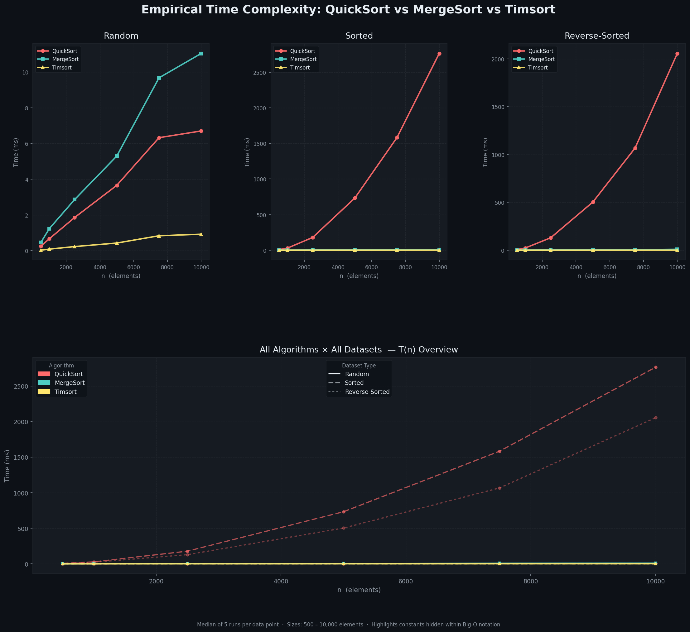

# Sorting Algorithm Empirical Analysis

An empirical study comparing **QuickSort**, **MergeSort**, and **Timsort** 
across three dataset distributions to expose the constants hidden within Big-O notation.

## Results (n = 10,000)
| Algorithm | Random | Sorted | Reverse-Sorted |
|-----------|--------|--------|----------------|
| QuickSort | 6.7 ms | 2,764 ms | 2,055 ms |
| MergeSort | 11.0 ms | 9.7 ms | 9.2 ms |
| Timsort   | 0.92 ms | 0.04 ms | 0.05 ms |

## Key Findings
- QuickSort (Lomuto) degrades **×307 slower** on sorted data due to O(n²) worst-case
- MergeSort delivers consistent O(n log n) regardless of input shape
- Timsort exploits natural runs, achieving near-O(n) on pre-sorted data

## Setup
pip install matplotlib numpy
python sorting_analysis.py

## Benchmark Chart

